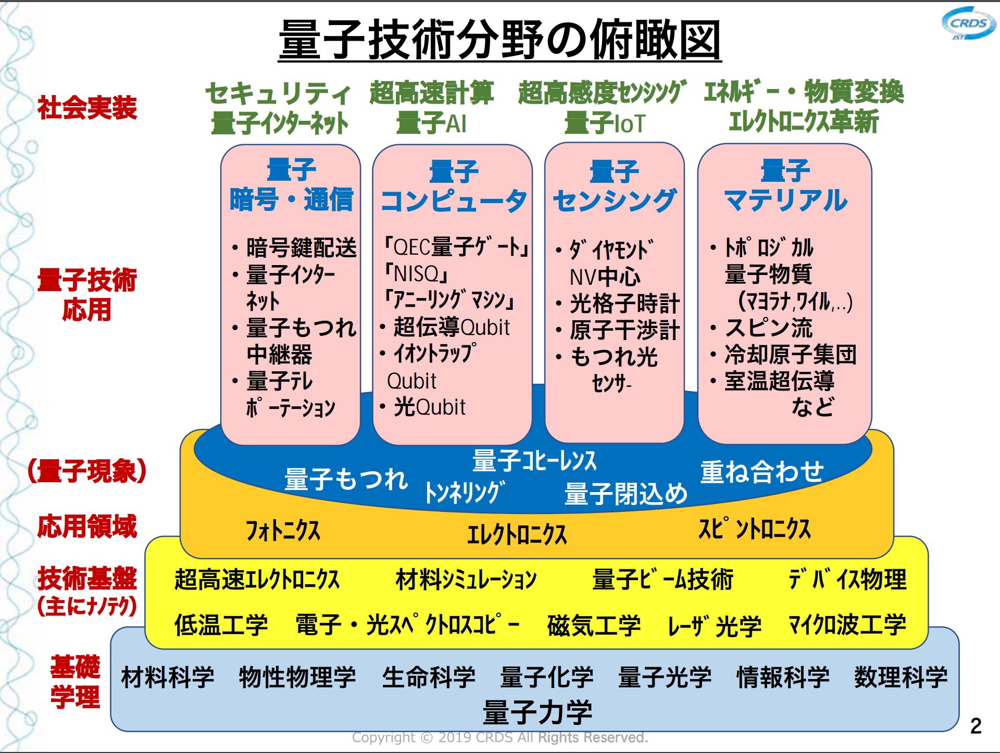

# README

- 量子ソフトウェア
- 量子アルゴリズム
- [The Quipper Language](https://www.mathstat.dal.ca/~selinger/quipper/)
  - [An Introduction to Quantum Programming in Quipper](https://arxiv.org/abs/1304.5485)
  - [Quipper: A Scalable Quantum Programming Language](https://arxiv.org/abs/1304.3390)

## カテゴリ

- 量子情報科学
  - 量子暗号・通信
    - 暗号鍵配送
    - 量子インターネット
    - 量子もつれ中継器
    - 量子テレポーテーション
  - 量子コンピュータ
    - QEC 量子ゲート
    - NISQ
    - アニーリングマシン
    - 超伝導 Qubit
    - イオントラップ Qubit
    - 光 Qubit
  - 量子センシング
  - 量子マテリアル
- 量子力学

## Books

### 量子情報科学

- [ようこそ量子 量子コンピュータはなぜ注目されているのか (丸善出版)](https://www.maruzen-publishing.co.jp/item/b293472.html)
- [量子コンピュータ―超並列計算のからくり (ブルーバックス)](https://bookclub.kodansha.co.jp/product?item=0000194430)
- [量子テレポーテーション―瞬間移動は可能なのか? (ブルーバックス)](https://bookclub.kodansha.co.jp/product?item=0000194609)
- [Ultimate Zero and One: Computing at the Quantum Frontier (springer)](https://www.springer.com/gp/book/9780387947693)
- [量子情報科学入門 (共立出版)](https://www.kyoritsu-pub.co.jp/bookdetail/9784320122994)
  - 量子情報科学の集中講義を書籍化したものです.
- [[PDF] Quantum Computation and Quantum Information: 10th Anniversary Edition (Cambridge University Press)](http://mmrc.amss.cas.cn/tlb/201702/W020170224608149940643.pdf)
  - 日本語訳
    - [量子コンピュータと量子通信I －量子力学とコンピュータ科学－](https://www.ohmsha.co.jp/book/9784274200076/)
    - [量子コンピュータと量子通信Ⅱ －量子コンピュータとアルゴリズム－](https://www.ohmsha.co.jp/book/9784274200083/)
    - [量子コンピュータと量子通信Ⅲ －量子通信・情報処理と誤り訂正－](https://www.ohmsha.co.jp/book/9784274200090/)
  - コメント
    - 原著は "Mike and Ike"とも呼ばれています. 標準的な大学院レベルの教科書です. 初学者にとって簡単なものではありませんが, 内容が多岐にわたっており, 非常に充実しています.
    - 勉強会での採用実績あり。
      - [量子情報勉強会](https://quantuminfo.connpass.com/)
      - [からすま数理セミナー](https://karasuma-math.connpass.com/)
- [Physics 219/Computer Science 219 course at Caltech](http://www.theory.caltech.edu/~preskill/ph229/)
  - ページの下部にあるJohnの講義ノートは、基礎について"Mike＆Ike"の素晴らしい代替になっています。 このページには有用なレビューへのリンクもあります。
- [量子情報理論 第3版](https://www.maruzen-publishing.co.jp/item/b303492.html)
- [量子情報理論入門](https://www.saiensu.co.jp/search/?isbn=4910054700541&y=2004)
- [Quantum Information Theory](https://www.sciencedirect.com/topics/physics-and-astronomy/quantum-information-theory)
- [みんなの量子コンピュータ](https://www.shoeisha.co.jp/book/detail/9784798163574)

---

- [絵で見てわかる量子コンピュータの仕組み](https://www.shoeisha.co.jp/book/detail/9784798157467)
  - 勉強会で初心者用の書籍として紹介されていた。

### 量子力学

- [なるほど量子力学](http://www.kaimeisha.com/index.php?%E3%81%AA%E3%82%8B%E3%81%BB%E3%81%A9%E9%87%8F%E5%AD%90%E5%8A%9B%E5%AD%A6I)
  - 初歩的な数学の導入も含んだ量子力学の本です.
- [ファインマン物理学V 量子力学](https://www.iwanami.co.jp/book/b257625.html)
  - ファインマン教授がカリフォルニア工科大学1,2年生向けに行った講義をまとめたものです.

## 参考

- [量子情報理論に関する教科書まとめ - Qiita](https://qiita.com/takuyakubo/items/f9039655ac0e07752e49)
- [先進的量子アーキテクチャ研究グループ](https://aqua.sfc.wide.ad.jp/for_students.html)
  - AQUAは慶應義塾大学湘南藤沢キャンパス徳田・村井・楠本・中村・高汐・バンミーター・植原・三次・中澤合同研究プロジェクト内の研究グループです。
- [量子技術分野の研究動向について](https://www.kantei.go.jp/jp/singi/ryoshigijutsu_innovation/dai1/siryou3.pdf)
- [米国における量子コンピュータの現状](https://www.ipa.go.jp/files/000072886.pdf)
- [量子ソフトウェア（QS）研究会新設のお知らせ](https://www.ipsj.or.jp/kenkyukai/newsig-qs.html)
- [戦略プロポーザル みんなの量子コンピューター ～情報・数理・電子工学と拓く新しい量子アプリ～](https://www.jst.go.jp/crds/pdf/2018/SP/CRDS-FY2018-SP-04.pdf)